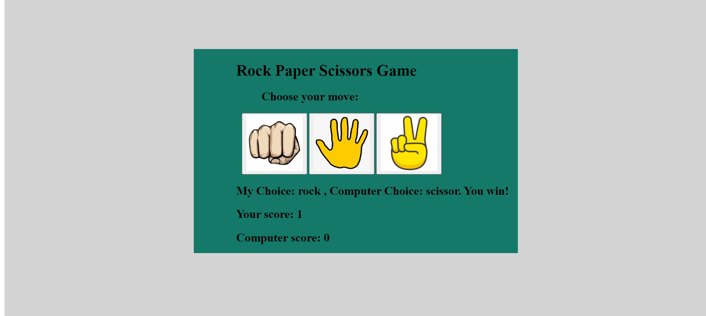
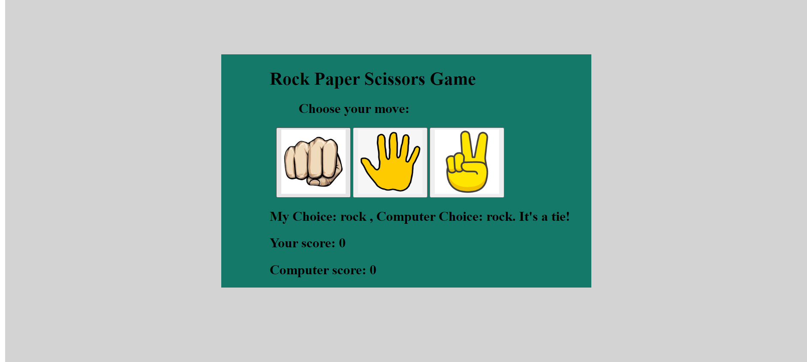

# Rock Paper Scissors Game

This is a simple **Rock Paper Scissors** game built using HTML, CSS, and JavaScript. The user selects either rock, paper, or scissors, and the computer randomly selects its move. The winner of each round is displayed along with updated scores for both the user and the computer.

## Features
- The user selects a move: **rock**, **paper**, or **scissors**.
- The computer randomly selects one of the three moves.
- The result is displayed (win, lose, or tie), along with the current score for both the user and the computer.
- The game uses images for each of the moves.

## How to Run
1. Clone or download the project files to your computer.
2. Ensure the images (`images.jpeg`, `images2.png`, `images3.png`) are in the project folder.
3. Open the `index.html` file in a web browser to play the game.

## Screenshots

### 1. Game Start

### 2. User Wins

### 3. Tie Result

## Project Files
- `index.html`: Contains the structure of the game.
- `RPC.css`: Contains the styles for the game layout.
- `RPC.js`: Contains the game logic in JavaScript.
- `images.jpeg`: Image used for the **rock** button.
- `images2.png`: Image used for the **paper** button.
- `images3.png`: Image used for the **scissor** button.

## How to Play
1. Open the game in your browser.
2. Choose your move by clicking on **rock**, **paper**, or **scissors**.
3. The computer will randomly choose its move.
4. The result of the game (win, lose, or tie) will be displayed along with both your score and the computer's score.
5. Keep playing to see who reaches a higher score!

## JavaScript Game Logic
- The user's choice is captured when clicking the buttons.
- The computer randomly selects a move from the options.
- The game compares the user and computer choices to determine the result.
- The score is updated based on the result (win, lose, or tie).

## Technologies Used
- HTML
- CSS
- JavaScript

## License
This project is open-source and available under the MIT License.
